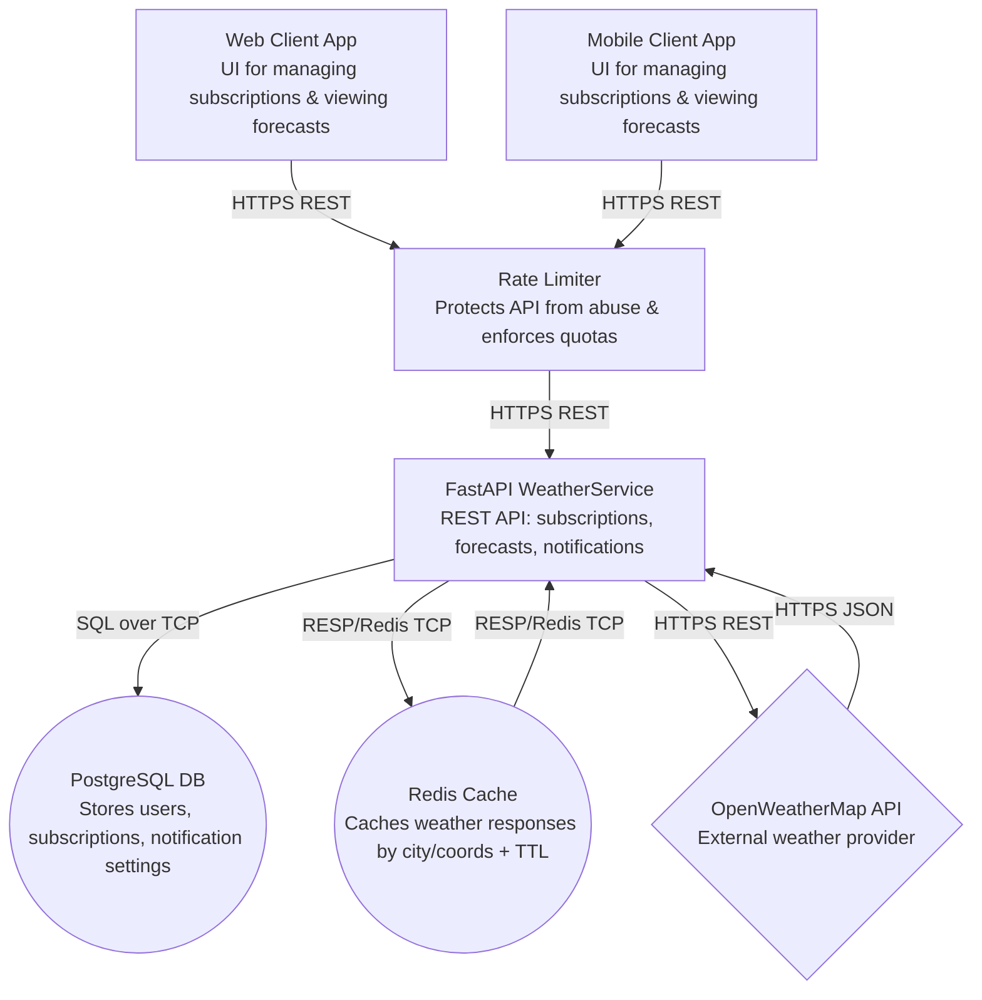

# Отчет по Практике 2: Дима Милана Вячеславовна

## 1. Анализ промптов R.C.T.F.

### Mermaid Diagram v2
**Role:** Senior DevOps Architect с опытом проектирования микросервисных систем
**Context:** Мы проектируем сервис 'WeatherService' — REST API для уведомлений о погоде. Текущие компоненты: 1. FastAPI Backend (REST API) 2. PostgreSQL Database (подписки пользователей) 3. OpenWeatherMap API (данные о погоде) 4. Client Apps (веб/мобильные приложения) Технологический стек: - Backend: Python (FastAPI) - База данных: PostgreSQL - Внешний API: OpenWeatherMap (REST) - Client Apps: Веб/мобильные приложения Новое требование: добавить Redis для кэширования данных о погоде.
**Task:** Модифицируй нашу базовую архитектуру: 1. Добавь Redis как компонент кэширования данных о погоде 2. Укажи протоколы взаимодействия между компонентами (REST, HTTP) 3. Добавь Rate Limiter для защиты API
**Format:** Сгенерируй Mermaid диаграмму компонентов. Требования к схеме: - Используй формат `graph TB` или `graph LR` - Для каждого компонента добавь краткое описание в квадратных скобках - Укажи протоколы на связях (например: "|REST API|") - Используй разные формы для разных типов компонентов ([] для сервисов, (()) для БД, {} для внешних API)
**Результат:** Сгенерировал обновленную диаграмму
---
### Gherkin Scenarios
**Role:** опытный QA Automation Engineer с 8-летним опытом в написании автоматизированных тестов для веб-сервисов и ботов.
**Context:** У нас есть User Story: Подписка на утреннюю сводку (v1.0) - Как пользователь, я хочу подписаться на ежедневную утреннюю сводку по email для моей локации, чтобы получать краткий прогноз перед выходом из дома. - Acceptance criteria: - Есть кнопка подписки в UI прогноза. - Форма собирает email и тип уведомления (утренняя сводка). - На email отправляется письмо подтверждения с ссылкой. - После подтверждения у пользователя появляется запись в БД подписок. Технический контекст: - Система: REST API на Python (FastAPI) - API погоды: OpenWeatherMap - База данных: PostgreSQL (хранит: email, city, notification_time) - Кэширование: Redis (кэш данных о погоде с TTL 10 минут) Пользовательский флоу через API: 1. Клиент отправляет POST /subscribe с {city, email} 2. API проверяет существование города через OpenWeatherMap 3. API сохраняет подписку в PostgreSQL 4. API возвращает подтверждение с данными о погоде
**Task:** Acceptance Criteria:	•	В UI прогноза есть кнопка «Подписаться на утреннюю сводку».	•	В форме подписки собираются: email и тип уведомления (утренняя сводка).	•	При POST /subscribe с {city, email} система проверяет город через OpenWeatherMap.	•	Если город валиден — создаётся подписка в PostgreSQL (email, city, notification_time=утро) и возвращаются данные о погоде.	•	Пользователю отправляется письмо подтверждения со ссылкой; после перехода по ссылке подписка становится активной.	•	Дубликат подписки (тот же email+city) не создаётся (возвращается ошибка).	•	Несуществующий город отклоняется (возвращается ошибка), запись в БД не создаётся.•	Город с лишними пробелами/спецсимволами корректно обрабатывается (нормализуется) или отклоняется, если OpenWeatherMap не распознаёт.	•	Данные погоды кэшируются в Redis на 10 минут.
**Format:** Используй строгий Gherkin-синтаксис (Given/When/Then). Cтруктура:Scenario 1: [Название позитивного сценария]  Given [предусловие]  When [действие] Then [ожидаемый результат]   And [дополнительная проверка] Scenario 2: [Название негативного сценария] аналогично Требования: - Минимум 2 позитивных сценария - Минимум 2 негативных сценария (несуществующий город, дубликат подписки) - 1 граничный случай (город с пробелами/спецсимволами) - Итого: минимум 5 сценариев
**Результат:** Сгенерировал 6 сценариев в формате Gherkin
---
### DoR v2.0
**Role:** Product Owner с 5-летним опытом в Agile/Scrum
**Context:** Мы разрабатываем WeatherService — REST API для уведомлений о погоде. Наш текущий Definition of Ready v1.0: 1. User story и Acceptance Criteria - Полное описание user story и минимум 2–3 acceptance criteria в Gherkin-стиле (Given/When/Then). - Критерии включают проверку создания подписки, подтверждения, доставки и обработки ошибок. 2. UX/Copy и дизайн-артефакты - Финальные макеты экранов/модалей для подписки, подтверждения и управления подписками. - Текст писем/SMS и i18n-ключи готовы. Включены примеры CTA и fallback-тексты для недостающих полей. 3. API / Events контракт и payload samples - Описаны REST-эндпоинты и внутренние события (см. plans/backend_requirements.md), включены примеры request/response и webhook payloads. - Назначен владелец контракта (API owner). 4. Инфраструктурные зависимости и конфигурация - Указаны провайдеры (email/SMS/push), очередь сообщений, quota и credentials; есть доступы/секреты в vault или инструкция для их получения. - Наличие feature-flag для поэтапного включения канала/ретраев. 5. Observability и тестовые данные - Список метрик/дэшбордов (delivery_rate, p95 latency, DLQ count) и критерии тревоги. - Подготовлены тестовые контакты/токены и план для e2e тестов (включая симуляцию ошибок провайдера). 6. Соответствие и безопасность - Модель согласий (consent) определена и хранение контактов соответствует политике конфиденциальности. - Определён процесс обработки DSR (удаление/анонимизация) и требования по шифрованию. Проблемы v1.0: - Слишком общий - Нет структуры по категориям - Нет специфики для REST API проекта
**Task:** Создай улучшенную версию Definition of Ready v2.0.
**Format:** Структурированный чек-лист в Markdown с категориями: - Requirements (требования к задаче) - Technical (технические аспекты) - Design (дизайн API/контракты) - Testing (тестирование) - Documentation (документация) Каждая категория должна содержать 3-5 конкретных пунктов.
**Результат:** Сгенерировал структурированный чек-лист DoR v2.0
---
### DoD v2.0
**Role:** Scrum Master с опытом в DevOps и CI/CD.
**Context:** Мы разрабатываем WeatherService — REST API для уведомлений о погоде.
Наш текущий Definition of Done v1.0:
DoD (Definition of Done) — Подписки и Уведомления (WeatherService)
Список из 5 пунктов, необходимых для пометки фичи как готовой к релизу.
1. Feature implemented и покрытие тестами
   - Backend: unit tests для логики подписок/диспетчера и интеграционные тесты для retry/DLQ.
   - Frontend: e2e-скрипт для подписки/подтверждения и тестового уведомления.
2. API и контракты задокументированы
   - OpenAPI/Swagger для публичных endpoint`ов и примеры payload для внутренних событий.
   - Подписаны контрактные поля с командами-потребителями (API owner).
3. Observability и алерты настроены
   - Дашборд с ключевыми метриками (delivery_rate, p95 latency, DLQ count) в prod/staging.
   - Алерты при порогах (drop in delivery_rate, DLQ spike).
4. Compliance и безопасность
   - Consent хранится и доступен для аудита; DSR-адаптер протестирован.
   - Все секреты и провайдерские ключи хранятся в Vault, доступные роли задокументированы.
5. Документация и handoff
   - Обновлён CJM и roadmap in plans/cjm.md.
   - Передача команде QA и разработчикам: checklist тест-кейсов и agenda для handoff-meeting.
Проблемы v1.0:
- Недостаточно деталей
- Нет структуры
- Нет специфики для REST API
**Task:** Создай улучшенную версию Definition of Done v2.0.
**Format:** Структурированный чек-лист в Markdown с категориями:
- Code (код)
- Tests (тесты)
- Documentation (документация)
- Review (код-ревью)
- Deployment (деплой)
Каждая категория должна содержать 3-5 конкретных пунктов.
**Результат:** Сгенерировал структурированный чек-лист DoD v2.0
---
### Test Plan v2.0
**Role:** Test Lead с 10-летним опытом в тестировании Python-приложений и микросервисов.Test Lead с 10-летним опытом в тестировании Python-приложений и микросервисов.
**Context:** Мы готовимся к тестированию User Story:
Подписка на утреннюю сводку (v1.0)
   - Как пользователь, я хочу подписаться на ежедневную утреннюю сводку по email для моей локации, чтобы получать краткий прогноз перед выходом из дома.
   - Acceptance criteria:
     - Есть кнопка подписки в UI прогноза.
     - Форма собирает email и тип уведомления (утренняя сводка).
     - На email отправляется письмо подтверждения с ссылкой.
     - После подтверждения у пользователя появляется запись в БД подписок.
Компоненты системы для тестирования:
graph TB
  %% Clients
  WEB[Web Client App<br/>UI for managing subscriptions & viewing forecasts]
  MOB[Mobile Client App<br/>UI for managing subscriptions & viewing forecasts]
  %% Edge / Protection
  RL[Rate Limiter<br/>Protects API from abuse & enforces quotas]
  %% Core service
  API[FastAPI WeatherService<br/>REST API: subscriptions, forecasts, notifications]
  %% Data stores
  PG((PostgreSQL DB<br/>Stores users, subscriptions, notification settings))
  REDIS((Redis Cache<br/>Caches weather responses by city/coords + TTL))
  %% External dependency
  OWM{OpenWeatherMap API<br/>External weather provider}
Технологии тестирования:
- Unit: pytest, pytest-asyncio
- Integration: pytest, testcontainers (для Redis, PostgreSQL)
- E2E: pytest, httpx (тестирование HTTP endpoints)
**Task:** Создай комплексный план тестирования для этой фичи. Включи тесты на всех уровнях: unit, integration, end-to-end.
**Format:** Markdown-таблица со следующими колонками:
| ID | Тип | Компонент | Описание | Предусловия | Шаги | Ожидаемый результат |
Требования:
- Минимум 12 тест-кейсов
- Распределение: ~50% unit, ~30% integration, ~20% e2e
- ID формата: TC-001, TC-002, ...
- Тип: Unit/Integration/E2E
- Покрыть позитивные, негативные и граничные случаи
**Результат:** Сгенерировал 20 тест-кейсов, распределённых по уровням тестирования
---
### Functional Delivery v2.0
**Role:** Senior Delivery Manager с опытом в Agile и управлении бэклогом.
**Context:** У нас есть базовые Jira-тикеты для WeatherService v1.0: Jira tickets (8) — WeatherService: Подписки и УведомленияНиже 8 тикетов, готовых для импорта в Jira. Каждый тикет содержит Title, Description, Acceptance Criteria, Test cases и Dependencies/Notes.---1) Title: SUB-001 — Subscription API и модель данныхDescription:  Разработать REST API для создания, подтверждения, получения и обновления подписок. Реализовать модель Subscription в Postgres с полями contact, channels, preferences, consent, status.Acceptance Criteria:  - POST /api/v1/subscriptions создает запись со статусом pending  - POST /api/v1/subscriptions/confirm переводит статус в active при валидном токене  - GET /api/v1/subscriptions/{id} возвращает корректные данные  - PATCH /api/v1/subscriptions/{id} обновляет preferences и channelsTest cases:  - TC: создать подписку с валидным email -> проверить pending запись  - TC: подтвердить подписку по токену -> статус active  - TC: обновить каналы -> проверки в БДDependencies/Notes:  - Зависит от: доступ к Postgres, секреты для генерации токенов  - Design: UX-макеты подписки (см. [plans/cjm.md](plans/cjm.md:1))---2) Title: SUB-002 — Email confirmation flow и шаблоныDescription:  Реализовать отправку email-подтверждений при создании подписки, шаблоны письма и endpoint для повторной отправки подтверждения.Acceptance Criteria:  - Письмо с confirmation_link отправляется при создании подписки  - confirmation_link ведёт на API, где POST /subscriptions/confirm принимает токен  - В письме есть unsubscribe-linkTest cases:  - TC: создать подписку -> проверить отправку email (mock/провайдер)  - TC: ссылка подтверждения переводит подписку в active  - TC: письмо содержит unsubscribe ссылкуDependencies/Notes:  - Интеграция с провайдером email (SendGrid/SES)  - Требуется шаблоны i18n (см. [plans/notification_templates.md](plans/notification_templates.md:1))---3) Title: SUB-003 — Push интеграция (FCM / APNs)Description:  Поддержать push-уведомления: регистрацию device_token, отправку тестового уведомления и обработку статусов доставки.Acceptance Criteria:  - UI/endpoint для регистрации device_token реализован  - Тестовое push-уведомление доставляется при нажатии кнопки  - Webhook/статусы провайдера корректно обрабатываютсяTest cases:  - TC: зарегистрировать device_token -> отправить test push -> проверить dispatched  - TC: симуляция провайдера returning delivered/failed -> проверить обновление NotificationRecordDependencies/Notes:  - Нужны ключи FCM/APNs и настройка push adapter  - Обратить внимание на platform-specific permission flows---4) Title: SUB-004 — SMS для критических предупрежденийDescription:  Добавить канал SMS для критических предупреждений: форма добавления номера, верификация (код/SMS) и интеграция с SMS-провайдером.Acceptance Criteria:  - Пользователь может добавить номер телефона и выбрать SMS для alerts  - При срабатывании alert генерируется SMS и отправляется провайдеру  - Логируются статусы отправки и попыткиTest cases:  - TC: добавить номер -> получить код подтверждения -> подтвердить  - TC: при trigger alert -> проверить запись в NotificationRecord и попытки отправки  - TC: симуляция failed -> retry и DLQ поведениеDependencies/Notes:  - Интеграция с локальным или глобальным SMS провайдером (Twilio и т.п.)  - Региональные ограничения и стоимость---5) Title: SUB-005 — Delivery Pipeline: Dispatcher, Retry и DLQDescription:  Построить pipeline: EventBus (queue) -> Dispatcher workers -> Provider adapters; реализовать retry policy (exponential backoff) и DLQ.Acceptance Criteria:  - Notifications от scheduler/rules попадают в очередь  - Dispatcher пытается отправить, повторяет по конфигу и помещает в DLQ при исчерпании попыток  - NotificationRecord хранит attempts, last_error и provider_message_idTest cases:  - TC: enqueue notification -> dispatcher обрабатывает -> provider получает request  - TC: симуляция 5xx -> multiple retries -> после N попыток запись в DLQ  - TC: idempotency: повторный enqueue с тем же idempotency-key не создает дубликатаDependencies/Notes:  - Требуется выбор EventBus (Kafka/Rabbit/SQS)  - Инструментирование tracing/metrics---6) Title: SUB-006 — Rules Engine и триггеры (cron/threshold)Description:  Реализовать rules engine для scheduled и threshold-based триггеров, экспортировать событие notification.scheduled в очередь.Acceptance Criteria:  - Можно создать правило: cron (daily_summary) и threshold (например wind_speed > X)  - При наступлении условия генерируется event notification.scheduled  - Rules могут быть привязаны к локациям и подпискамTest cases:  - TC: создать cron-rule -> проверить generation of events в ожидаемое время  - TC: создать threshold-rule -> отправить mock-weather-event -> проверить генерацию notificationDependencies/Notes:  - Возможно выделенный сервис rules-engine или использование существующего scheduler---7) Title: SUB-007 — Observability, метрики и алертыDescription:  Настроить сбор метрик и дашборды: delivery_rate, attempts, p95 dispatch latency, DLQ count; настроить алерты при деградации.Acceptance Criteria:  - Есть дашборд с ключевыми SLI/SLAs  - Настроены алерты: drop in delivery_rate, DLQ spike, p95 latency > threshold  - События трассируются через pipeline (request_id/event_id)Test cases:  - TC: сымитировать падение delivery_rate -> проверить, что alert сработал  - TC: проверить наличие трассы по request_id в логах для заданного notification_idDependencies/Notes:  - Интеграция с Prometheus/Grafana или облачной APM---8) Title: SUB-008 — Compliance, Consent и DSRDescription:  Обеспечить хранение согласий (consent), реализацию процесса DSR (удаление/анонимизация), audit-log всех изменений статуса подписки.Acceptance Criteria:  - Consent сохраняется при создании подписки с timestamp и source  - Есть API для подачи DSR и удаления/анонимизации контакта  - Audit-log сохраняет все изменения статусов и запросы на удалениеTest cases:  - TC: создать подписку с consent -> проверить запись consent  - TC: выполнить DSR -> проверить удаление/анонимизацию и audit-logDependencies/Notes:  - Согласовать с legal/GDPR командой формат хранения и retention policy---Проблемы текущих тикетов:- Недостаточно детальные Acceptance Criteria- Нет зависимостей между тикетами- Нет приоритетов- Нет оценок времени- Тест-кейсы слишком общие
**Task:** Улучши эти тикеты до профессионального уровня.
**Format:** Структурированный список тикетов в Markdown. Каждый тикет должен содержать: - Title (название) - Description (описание задачи) - Acceptance Criteria (детальные в формате Given/When/Then) - Test Cases (детальные тест-кейсы) - Dependencies (зависимости от других тикетов) - Priority (High/Medium/Low) - Estimate (story points или часы)
**Результат:** Сгенерировал улучшенные Jira-тикеты
---
## 2. Улучшенные артефакты

### Mermaid v2


### Gherkin Scenarios
```gherkin

Feature: Morning email digest subscription v1.0

  Background:
    Given the WeatherService API is running
    And PostgreSQL is available and the subscriptions table is empty for test emails
    And Redis is available and empty for keys related to test cities
    And OpenWeatherMap API is reachable for city validation

  Scenario 1: Create morning digest subscription for a valid city and return weather data (happy path)
    Given a user has entered email "user1@example.com" and selected notification type "morning digest" in the subscription form
    And the user has chosen city "Helsinki"
    When the client sends POST "/subscribe" with JSON:
    {"city":"Helsinki","email":"user1@example.com"}
    Then the response status code should be 201
    And the response body should include "city" = "Helsinki"
    And the response body should include weather data fields
    And a subscription record should be created in PostgreSQL with:
      | email             | city     | notification_time | status   |
      | user1@example.com | Helsinki | morning           | pending  |
    And a confirmation email should be sent to "user1@example.com" containing a confirmation link

  Scenario 2: Confirm subscription via email link and activate it
    Given an existing pending subscription in PostgreSQL for:
      | email             | city     | notification_time | status  |
      | user2@example.com | Tallinn  | morning           | pending |
    And a confirmation token exists for "user2@example.com" and city "Tallinn"
    When the user opens the confirmation link for that token
    Then the response status code should be 200
    And the subscription record in PostgreSQL should be updated to status "active"
    And the user should see a confirmation message that the subscription is activated

  Scenario 3: Weather data is cached in Redis for 10 minutes after subscription
    Given the city "Oslo" is valid in OpenWeatherMap
    And there is no Redis cache entry for city "Oslo"
    When the client sends POST "/subscribe" with JSON:
      {"city":"Oslo","email":"user3@example.com"}
    Then the response status code should be 201
    And Redis should contain a cache entry for city "Oslo" with TTL of 600 seconds
    And the cached value should contain weather data matching the response body

  Scenario 4: Reject subscription when city does not exist (negative)
    Given a user has entered email "user4@example.com" and selected notification type "morning digest" in the subscription form
    And the user has chosen city "NoSuchCity_12345"
    When the client sends POST "/subscribe" with JSON:
      {"city":"NoSuchCity_12345","email":"user4@example.com"}
    Then the response status code should be 400
    And the response body should include an error message about invalid or unknown city
    And no subscription record should be created in PostgreSQL for email "user4@example.com" and city "NoSuchCity_12345"
    And no confirmation email should be sent to "user4@example.com"

  Scenario 5: Reject duplicate subscription for same email and city (negative)
    Given an existing subscription in PostgreSQL for:
      | email             | city     | notification_time | status |
      | user5@example.com | Riga     | morning           | active |
    When the client sends POST "/subscribe" with JSON:
      {"city":"Riga","email":"user5@example.com"}
    Then the response status code should be 409
    And the response body should include an error message about duplicate subscription
    And no additional subscription record should be created in PostgreSQL for email "user5@example.com" and city "Riga"
    And no confirmation email should be sent to "user5@example.com"

  Scenario 6: Handle city input with extra spaces and special symbols (boundary)
    Given a user has entered email "user6@example.com" and selected notification type "morning digest" in the subscription form
    And the user has chosen city "  São   Paulo!!!  "
    When the client sends POST "/subscribe" with JSON:
      {"city":"  São   Paulo!!!  ","email":"user6@example.com"}
    Then the system should normalize the city input or reject it based on OpenWeatherMap recognition
    And if OpenWeatherMap recognizes the normalized city then:
      | expected_status |
      | 201            |
    And a subscription record should be created in PostgreSQL with city equal to the normalized value and status "pending"
    And a confirmation email should be sent to "user6@example.com"
    And if OpenWeatherMap does not recognize the normalized city then:
      | expected_status |
      | 400            |
    And no subscription record should be created in PostgreSQL for email "user6@example.com"
    And no confirmation email should be sent to "user6@example.com"

```

### DoR v2.0

DoR v2.0 — WeatherService (REST API: Подписки и Уведомления)

Requirements
	•	User Story сформулирована в формате роль → потребность → ценность, указан бизнес-контекст (для кого, когда, зачем).
	•	Acceptance Criteria: минимум 3 пункта, включая 1 позитивный и 1 негативный кейс; критерии проверяемы (Given/When/Then).
	•	Определены правила идемпотентности/дубликатов (например, уникальность email+city+type) и ожидаемые ошибки.
	•	Определены ограничения и правила: таймзона, время уведомления “утро”, формат email/города, лимиты подписок на пользователя (если есть).
	•	Понятны зависимости и границы: что делаем в этой задаче, что явно не делаем (out of scope).

Technical
	•	Определены зависимости: OpenWeatherMap (проверка города), PostgreSQL (подписки), Redis (кэш погоды TTL=10 мин), Email-провайдер (подтверждение).
	•	Есть требования к отказоустойчивости: таймауты/ретраи/обработка деградации (например, OWM недоступен → ошибка/фоллбек).
	•	Определены нефункциональные требования: целевые SLO/латентность, лимиты запросов, ожидаемая нагрузка, rate limiting стратегия.
	•	Описана модель данных и миграции: поля (email, city, notification_time, status, token, timestamps), индексы/уникальные ключи.
	•	Определены требования к безопасности: валидация входных данных, защита токенов подтверждения, хранение секретов (env/vault).

Design (дизайн API/контракты)
	•	Эндпоинты описаны и согласованы (минимум): POST /subscribe, GET/POST /confirm (или эквивалент) — с назначением и статус-кодами.
	•	Контракт request/response зафиксирован: обязательные поля, типы, примеры payload, формат ошибок (единый error schema).
	•	Определены правила нормализации city (trim, collapse spaces, допустимые символы) и ожидаемое поведение при нераспознавании OWM.
	•	Описан кэш-паттерн (cache-aside): ключи, TTL=600s, что кэшируем (weather response), когда инвалидируем/обновляем.
	•	Зафиксирована стратегия идемпотентности: заголовок/ключ (Idempotency-Key) или уникальные ограничения + поведение при повторном запросе.

Testing
	•	Есть список тестов уровня API: happy path, несуществующий город, дубликат подписки, подтверждение подписки, валидация входных данных.
	•	Определены моки/стабы: OpenWeatherMap (валидный/невалидный город), email-провайдер (перехват письма/линка), Redis (TTL проверка).
	•	Определены проверки БД: создание записи pending, переход в active после подтверждения, отсутствие записи при ошибках.
	•	Определены проверки кэша: запись в Redis и TTL ≈ 600s, повторное использование кэша (при повторных запросах/в рамках задачи — если применимо).
	•	Согласованы критерии “готово протестировано”: где прогоняются тесты (CI), какие окружения, минимальный набор regression.

Documentation
	•	Обновлён OpenAPI/Swagger: описания эндпоинтов, схемы, примеры, коды ошибок.
	•	Добавлено описание бизнес-флоу подписки: pending → email confirm → active, включая исключения и повторные попытки.
	•	Описаны настройки и конфиги: переменные окружения, ключи OWM, Redis/DB, параметры TTL/таймаутов/лимитов.
	•	Описаны observability-аспекты: ключевые метрики (подписки создано, confirm rate, email send failures, cache hit rate), логи/трейсы.
	•	Добавлены заметки по эксплуатации: rate limiting правила, ограничения внешнего API, диагностика типовых ошибок.


### DoD v2.0

DoD v2.0 — WeatherService (REST API: Подписки и Уведомления)

Code (код)
	•	Реализованы все AC из user story: подписка POST /subscribe, подтверждение, статусы (pending → active), обработка ошибок.
	•	Валидация и нормализация входных данных (email, city) реализованы и консистентны во всех путях выполнения.
	•	Идемпотентность/антидубликаты обеспечены (уникальный ключ email+city+type или эквивалент), поведение при повторе документировано в коде.
	•	Интеграция с Redis выполнена (TTL=600s), исключения/фоллбеки при недоступности Redis обработаны (без падения сервиса).
	•	Логи и метрики добавлены для ключевых шагов (subscribe, confirm, email send, cache hit/miss, OWM errors) без утечек PII/секретов.

Tests (тесты)
	•	Unit-тесты покрывают: нормализацию city, валидацию email, антидубликаты, генерацию/проверку токена подтверждения, переход статусов.
	•	Интеграционные тесты покрывают: PostgreSQL запись/уникальность, Redis cache set + TTL≈600s, взаимодействие с mock OpenWeatherMap.
	•	Негативные тесты: несуществующий город, дубликат подписки, некорректный email, истёкший/невалидный token подтверждения.
	•	Контрактные тесты/проверки схем: соответствие OpenAPI (request/response/error schema), стабильность кодов ошибок (400/409/5xx).
	•	Тесты запускаются в CI и стабильны (без флейков): детерминированные моки, фиксированные таймауты, изоляция данных.

Documentation (документация)
	•	OpenAPI/Swagger обновлён: эндпоинты, схемы, примеры, статусы, формат ошибок (единый error schema).
	•	Описан флоу подписки: pending → email confirm → active, включая повторные клики по ссылке и ошибки.
	•	Документированы настройки: env-переменные (OWM key, DB, Redis), TTL кэша, таймауты, rate limiting параметры.
	•	Добавлены эксплуатационные заметки: ключевые метрики/алерты, как диагностировать типовые сбои (OWM/Redis/email).
	•	Обновлены миграции/схема данных: поля, индексы, уникальные ограничения; указана стратегия отката.

Review (код-ревью)
	•	Минимум 1–2 аппрува от команды (включая владельца компонента), все комментарии закрыты или отложены с явным решением.
	•	Проверены security-пункты: нет логирования токенов/секретов, корректные HTTP статусы, защита от инъекций, ограничения по входным данным.
	•	Проверены архитектурные решения: кэш-паттерн, обработка деградации (OWM/Redis/email), согласованная стратегия идемпотентности.
	•	Выполнены статические проверки: линтеры/форматтеры, type checks (если используются), dependency scan (если включён в пайплайн).
	•	Согласованы изменения контрактов с потребителями (если есть): версия/обратная совместимость/депрекейшн.

Deployment (деплой)
	•	CI/CD пайплайн зелёный: сборка, тесты, проверки качества, сборка образа, публикация артефактов.
	•	Миграции применяются автоматически/по процедуре и протестированы на staging; есть понятный rollback plan.
	•	Конфигурация окружений обновлена: секреты в vault/secret store, значения TTL=600s, настройки rate limiter.
	•	Деплой в staging выполнен и подтверждён smoke-тестами: /health, /subscribe, /confirm (с моками или тестовыми провайдерами).
	•	Наблюдаемость включена: дашборды/алерты активны, базовые SLO (например, p95 latency, error rate) в норме после релиза.


### Test Plan v2

| ID | Тип | Компонент | Описание | Предусловия | Шаги | Ожидаемый результат |
|---|---|---|---|---|---|---|
| TC-001 | Unit | API | Валидация email: корректный формат принимается | Нет | 1) Вызвать валидатор email с `user@example.com` | Валидатор возвращает OK, ошибок нет |
| TC-002 | Unit | API | Валидация email: некорректный формат отклоняется | Нет | 1) Вызвать валидатор email с `user@@example` | Возвращается ошибка валидации |
| TC-003 | Unit | API | Нормализация city: trim + схлопывание пробелов | Нет | 1) Нормализовать `"  New   York  "` | Результат `"New York"` |
| TC-004 | Unit | API | Нормализация city: обработка спецсимволов (политика: удалить/оставить/отклонить) | Определена политика нормализации | 1) Нормализовать `"São   Paulo!!!"` | Либо спецсимволы удалены/экранированы согласно политике, либо возвращена ошибка нормализации (детерминированно) |
| TC-005 | Unit | API | Логика антидубликата: повторная подписка `email+city+type` вызывает ошибку | Репозиторий/DAO замокан: “существует запись” | 1) Вызвать сервис `create_subscription(email, city, morning)` | Возвращается доменная ошибка “duplicate” (мапится в 409) |
| TC-006 | Unit | API | Установка значений по умолчанию: `notification_time=morning`, `status=pending` | Нет | 1) Создать subscription model из входных `{email, city}` | Поля проставлены корректно (`morning`, `pending`) |
| TC-007 | Unit | API | Генерация токена подтверждения: уникальность и срок жизни | Конфиг TTL токена задан | 1) Сгенерировать 2 токена 2) Проверить формат/длину 3) Проверить наличие exp/TTL | Токены различаются, валидный формат, TTL/exp задан |
| TC-008 | Unit | API | Верификация токена: валидный токен активирует подписку | Репозиторий замокан: запись `pending` существует | 1) Вызвать `confirm_subscription(token)` | Возвращается success, статус меняется на `active` (в слое домена) |
| TC-009 | Unit | API | Верификация токена: истёкший/невалидный токен отклоняется | Репозиторий/крипто-валидатор замокан | 1) Вызвать `confirm_subscription(expired_token)` | Возвращается доменная ошибка “invalid/expired” (мапится в 400/404 по контракту) |
| TC-010 | Unit | API | Cache-aside: при cache miss вызывается OWM-клиент и результат готов к записи в Redis | Redis-клиент и OWM-клиент замоканы | 1) Запросить weather для city с пустым кэшем 2) Проверить вызовы | Был вызов OWM, сформирован payload для cache set с TTL=600 |
| TC-011 | Unit | RL | Rate limiting: превышение лимита приводит к отказу | Модуль RL сконфигурирован (лимит N) | 1) Эмулировать N+1 запросов от одного ключа/клиента | N запросов разрешены, N+1 отклонён (например, 429) |
| TC-012 | Integration | API + PG | Создание подписки записывает `pending` в PostgreSQL и возвращает 201 | testcontainers: PostgreSQL поднят, миграции применены; OWM замокан как валидный | 1) POST `/subscribe` `{city,email}` 2) SELECT из subscriptions | HTTP 201, в БД 1 запись с `email, city(normalized), notification_time=morning, status=pending` |
| TC-013 | Integration | API + PG | Дубликат подписки не создаётся (уникальный индекс/логика) | PostgreSQL поднят; есть существующая запись | 1) Создать подписку 2) Повторить POST теми же `{city,email}` | Второй запрос возвращает 409, в БД по-прежнему 1 запись |
| TC-014 | Integration | API + Redis | Кэш погоды создаётся в Redis с TTL≈600 после `/subscribe` | Redis поднят; OWM замокан валидный; для ключа кэша пусто | 1) POST `/subscribe` 2) Проверить Redis key 3) Проверить TTL | Redis key существует, TTL в диапазоне около 600 секунд, значение соответствует структуре weather |
| TC-015 | Integration | API + OWM(mock) | Несуществующий город отклоняется и не пишет в БД | PostgreSQL поднят; OWM mock возвращает “not found” | 1) POST `/subscribe` с несуществующим city 2) SELECT из БД | HTTP 400, в БД нет записи, в Redis нет кэша, email не отправлен |
| TC-016 | Integration | API + Mailer(mock) + PG | Письмо подтверждения отправляется и содержит ссылку с токеном | PostgreSQL поднят; mailer заглушка/spy включена; OWM валиден | 1) POST `/subscribe` 2) Перехватить письмо 3) Проверить содержимое | Письмо отправлено 1 раз, содержит URL с токеном, в БД статус `pending` и токен сохранён/связан |
| TC-017 | E2E | WEB/UI + API + PG | UI: кнопка “Подписаться на утреннюю сводку” открывает форму и отправляет запрос | E2E окружение доступно; UI развернут; backend доступен | 1) Открыть экран прогноза 2) Нажать кнопку 3) Ввести email 4) Выбрать “утренняя сводка” 5) Submit | Кнопка видна, форма валидируется, отправляется запрос, UI показывает успешное состояние/сообщение |
| TC-018 | E2E | API + PG + Mailer(mock) | Полный флоу: subscribe → получение ссылки → confirm → статус active | Mailer mock перехватывает письма; PG/Redis подняты; OWM валиден | 1) POST `/subscribe` 2) Извлечь confirm link из письма 3) Перейти по ссылке/вызвать `/confirm` 4) Проверить БД | Subscribe возвращает 201, confirm возвращает 200, в БД статус `active` для этой подписки |
| TC-019 | E2E | API + RL | Rate limiter: серия запросов к `/subscribe` блокируется после лимита | RL включён и настроен для тестового ключа/IP | 1) Отправить серию POST `/subscribe` (N+1) с различными email | До лимита ответы успешны/валидны, затем 429 (или согласованный код), сервис остаётся доступным |
| TC-020 | E2E | API + Redis | Повторный запрос на подписку для другого email использует кэш погоды (если применимо) | Redis пуст; OWM mock считает вызовы; city один и тот же | 1) POST `/subscribe` для `userA` 2) POST `/subscribe` для `userB` с тем же city в течение 10 мин 3) Проверить счётчик OWM | Второй запрос возвращает погоду без дополнительного вызова OWM (cache hit), TTL не превышает 600 секунд |


### Functional Delivery v2.0

Улучшенные Jira-тикеты — WeatherService v1.0 (Подписки и уведомления)

Оценки даны в Story Points (SP). Зависимости указаны как ссылки на тикеты из списка.

⸻

SUB-001 — Subscription API и модель данных (PostgreSQL)

Title: SUB-001 — Subscription API + PostgreSQL model (CRUD + confirm)

Description:
Реализовать базовый REST API для управления подписками и модель данных в PostgreSQL. Включает создание подписки со статусом pending, подтверждение по токену до active, чтение по id, частичное обновление предпочтений/каналов. Обеспечить уникальность подписки и базовую валидацию входных данных.

Acceptance Criteria (Given/When/Then):
	•	Create subscription (pending):
Given валидные email и city и выбран тип уведомления morning
When клиент вызывает POST /api/v1/subscriptions
Then создаётся запись в БД со статусом pending, notification_time=morning, и возвращается 201 с subscription_id и статусом pending.
	•	Duplicate protection:
Given существует подписка с тем же email+city+notification_time
When клиент повторяет POST /api/v1/subscriptions с теми же данными
Then возвращается 409 и новая запись в БД не создаётся.
	•	Get subscription:
Given существует подписка subscription_id
When клиент вызывает GET /api/v1/subscriptions/{id}
Then возвращается 200 и данные соответствуют записи в БД.
	•	Patch preferences/channels:
Given существует подписка active или pending
When клиент вызывает PATCH /api/v1/subscriptions/{id} с валидными изменениями
Then возвращается 200, в БД обновляются только разрешённые поля, запрещённые игнорируются/ошибка по контракту.
	•	Confirm token changes status:
Given существует pending подписка с валидным токеном подтверждения
When клиент вызывает POST /api/v1/subscriptions/confirm с токеном
Then возвращается 200, статус становится active, токен становится одноразовым/инвалидируется.

Test Cases (детально):
	•	TC1: POST create → 201; проверить запись в PG (pending, morning, timestamps).
	•	TC2: POST duplicate → 409; проверить количество записей не изменилось.
	•	TC3: GET by id → 200; сверить поля с PG.
	•	TC4: PATCH разрешённых полей → 200; проверить только нужные поля обновились.
	•	TC5: Confirm валидным токеном → 200; статус active.
	•	TC6: Confirm повторно тем же токеном → 400/409 (по контракту); статус не меняется.

Dependencies:
	•	Внешние: доступ к PostgreSQL, миграции, секрет для подписи/генерации токенов.

Priority: High
Estimate: 8 SP

⸻

SUB-002 — Email confirmation flow и шаблоны

Title: SUB-002 — Email confirmation + resend + unsubscribe link

Description:
Добавить отправку email-подтверждения при создании подписки, шаблон письма, endpoint повторной отправки подтверждения, и включить unsubscribe link (как минимум как заготовку/контракт). Интеграция через адаптер (mockable).

Acceptance Criteria (Given/When/Then):
	•	Send confirmation on create:
Given создана подписка со статусом pending
When POST /api/v1/subscriptions завершился успешно
Then отправляется email на адрес подписки с confirmation_link и unsubscribe_link.
	•	Confirm via link:
Given пользователь переходит по confirmation_link (токен)
When система принимает токен в POST /api/v1/subscriptions/confirm
Then подписка становится active, ответ 200.
	•	Resend confirmation:
Given подписка pending существует
When клиент вызывает POST /api/v1/subscriptions/{id}/resend-confirmation
Then отправляется новое письмо подтверждения, ответ 202 (или 200 по контракту).
	•	No resend for active:
Given подписка active
When вызывается resend endpoint
Then возвращается 409 (или 400) и письмо не отправляется.

Test Cases (детально):
	•	TC1: Создать подписку → перехватить письмо (mock provider) → проверить наличие ссылок и токена.
	•	TC2: Перейти по confirmation → статус в PG active.
	•	TC3: Resend для pending → письмо отправлено повторно, лимит/троттлинг (если задан) соблюдён.
	•	TC4: Resend для active → ошибка, письмо не отправлено.
	•	TC5: Письмо содержит unsubscribe URL с корректной структурой (пусть даже endpoint в SUB-008).

Dependencies:
	•	SUB-001 (модель и confirm endpoint)
	•	Доступ к email провайдеру / mock; шаблоны (plans/notification_templates.md)

Priority: High
Estimate: 5 SP

⸻

SUB-003 — Push интеграция (FCM/APNs)

Title: SUB-003 — Push channel: device token registration + test push + delivery status webhook

Description:
Реализовать push-канал: регистрацию device_token, отправку тестового push, обработку статусов доставки (callback/webhook или polling — по выбранному провайдеру). Данные хранить в БД, адаптер провайдера — заменяемый.

Acceptance Criteria (Given/When/Then):
	•	Register device token:
Given авторизованный клиент (или иной согласованный механизм идентификации)
When вызывает endpoint регистрации device_token
Then токен сохраняется и возвращается 200/201.
	•	Send test push:
Given для подписки есть активный device_token
When клиент вызывает endpoint test push
Then провайдер вызывается, создаётся запись NotificationRecord, ответ 202.
	•	Delivery status update:
Given провайдер присылает статус delivered/failed
When webhook обработан
Then NotificationRecord обновлён корректно.

Test Cases (детально):
	•	TC1: Register token → проверить запись в PG.
	•	TC2: Test push → проверить вызов адаптера провайдера и NotificationRecord.
	•	TC3: Webhook delivered → статус NotificationRecord=delivered.
	•	TC4: Webhook failed → last_error заполнен, attempts не растут (если это финальный статус).

Dependencies:
	•	SUB-001 (подписки)
	•	SUB-005 (NotificationRecord/поставка уведомлений — если shared model) или отдельная минимальная таблица под push.

Priority: Low (для v1.0 утренней сводки по email — не критично)
Estimate: 8 SP

⸻

SUB-004 — SMS для критических предупреждений

Title: SUB-004 — SMS channel: phone add + verification + send alerts

Description:
Добавить SMS как канал для критических алертов: сбор номера, верификация кодом, отправка сообщений, учёт статусов и попыток. В v1.0 может быть ограничено минимальным API и заглушкой провайдера.

Acceptance Criteria (Given/When/Then):
	•	Add phone + start verification:
Given пользователь вводит номер телефона
When вызывает endpoint добавления номера
Then создаётся verification challenge и отправляется SMS с кодом.
	•	Confirm phone:
Given пользователь вводит корректный код
When вызывает endpoint подтверждения
Then номер помечается verified и доступен для alerts.
	•	Send alert SMS:
Given алерт сработал и канал SMS включён
When диспетчер отправляет SMS
Then создаётся NotificationRecord, статус отражает результат.

Test Cases (детально):
	•	TC1: Add phone → mock provider получил SMS с кодом.
	•	TC2: Confirm корректным кодом → phone verified.
	•	TC3: Trigger alert → NotificationRecord создан, попытки и статусы корректны.
	•	TC4: Provider fail → retry/DLQ (если используется общий pipeline).

Dependencies:
	•	SUB-005 (retry/DLQ)
	•	Провайдер SMS + региональные требования

Priority: Low
Estimate: 13 SP

⸻

SUB-005 — Delivery Pipeline: Dispatcher, Retry и DLQ

Title: SUB-005 — Notification delivery pipeline: queue → dispatcher → provider adapters + retry/DLQ

Description:
Построить delivery pipeline для уведомлений: очередь (EventBus), воркеры-диспетчеры, адаптеры провайдеров. Реализовать retry policy (exponential backoff), DLQ и идемпотентность. Это базис для надёжной доставки email/push/sms.

Acceptance Criteria (Given/When/Then):
	•	Enqueue:
Given создано событие notification.scheduled
When событие публикуется в очередь
Then оно доступно для обработки dispatcher-ом.
	•	Dispatch success path:
Given сообщение в очереди и провайдер доступен
When dispatcher обрабатывает сообщение
Then провайдер вызывается 1 раз, создаётся/обновляется NotificationRecord со статусом dispatched/sent.
	•	Retry on transient failure:
Given провайдер возвращает 5xx/timeout
When dispatcher получает ошибку
Then выполняются ретраи по конфигу, attempts увеличивается, сохраняется last_error.
	•	DLQ on exhausted retries:
Given ретраи исчерпаны
When последняя попытка неуспешна
Then сообщение попадает в DLQ, NotificationRecord помечается failed.
	•	Idempotency:
Given повторное сообщение с тем же idempotency key
When dispatcher обрабатывает повтор
Then дубликат отправки не выполняется, запись не дублируется.

Test Cases (детально):
	•	TC1: enqueue → dispatcher → provider called → NotificationRecord updated.
	•	TC2: provider 5xx → N retries → verify backoff scheduling (минимум факт N попыток).
	•	TC3: after N retries → DLQ contains message, NotificationRecord=failed.
	•	TC4: duplicate idempotency key → only one provider call.

Dependencies:
	•	Решение по EventBus (Kafka/Rabbit/SQS)
	•	SUB-007 (частично, для метрик) — не блокирующая, но желательно параллельно

Priority: Medium (для email утренней сводки можно упрощать, но лучше иметь базис)
Estimate: 13 SP

⸻

SUB-006 — Rules Engine и триггеры (cron/threshold)

Title: SUB-006 — Rules engine: daily cron (morning digest) + threshold triggers → emits notification.scheduled

Description:
Реализовать правила генерации событий уведомлений: cron для ежедневной утренней сводки и threshold-правила (как расширение). Генерировать события в очередь (или напрямую в dispatcher, если pipeline упрощён).

Acceptance Criteria (Given/When/Then):
	•	Create cron rule:
Given подписка active с типом morning
When время соответствует cron-правилу
Then генерируется notification.scheduled для этой подписки.
	•	Bind rule to subscription/location:
Given подписка привязана к city
When правило срабатывает
Then событие содержит нормализованную локацию и ссылку на subscription_id.
	•	Threshold rule (если входит в v1.0 scope):
Given задан threshold (например wind_speed > X)
When входные данные погоды удовлетворяют условию
Then событие генерируется один раз по правилам дедупликации.

Test Cases (детально):
	•	TC1: Cron rule → “время наступило” → событие опубликовано.
	•	TC2: Проверить payload события: subscription_id, city, type, idempotency key.
	•	TC3: Threshold rule → mock weather → событие есть/нет по условию.

Dependencies:
	•	SUB-001 (active subscriptions)
	•	SUB-005 (если доставка через очередь)
	•	Доступ к источнику времени/cron runner (APS/Cloud scheduler)

Priority: Medium (утренняя сводка требует cron)
Estimate: 8 SP

⸻

SUB-007 — Observability: метрики, логи, алерты

Title: SUB-007 — Observability for subscriptions & notifications: metrics + dashboards + alerts + tracing IDs

Description:
Добавить наблюдаемость: метрики API (latency, error rate), метрики доставки (delivery_rate, attempts, DLQ), корреляция request_id/event_id, и алерты. Настроить дашборды в staging/prod.

Acceptance Criteria (Given/When/Then):
	•	Metrics emitted:
Given обработка POST /subscriptions и POST /confirm
When запросы выполняются
Then публикуются метрики latency p50/p95, status codes, error rate.
	•	Delivery metrics:
Given dispatcher отправляет уведомления
When выполняются attempts/retries/DLQ
Then метрики attempts, success/fail, DLQ count обновляются.
	•	Alerts configured:
Given delivery_rate падает ниже порога или DLQ растёт
When выполняются условия
Then алерт срабатывает и содержит ссылку на дашборд/руководство.
	•	Traceability:
Given есть request_id/event_id
When ищем запись в логах/трейсах
Then можно связать API request → событие → попытки доставки.

Test Cases (детально):
	•	TC1: Прогнать тестовый запрос → проверить наличие метрик endpoint-а.
	•	TC2: Симулировать DLQ spike → проверить алерт/правило.
	•	TC3: Проверить корреляцию: request_id присутствует в логах API и dispatcher.

Dependencies:
	•	SUB-005 (для delivery метрик)
	•	Интеграция Prometheus/Grafana/APM

Priority: Medium
Estimate: 5 SP

⸻

SUB-008 — Compliance, Consent и DSR

Title: SUB-008 — Consent + DSR (delete/anonymize) + audit log for subscriptions

Description:
Обеспечить хранение согласия (consent), реализацию DSR (удаление/анонимизация), и аудит-лог всех изменений статуса подписки. Включить ограничения на логирование PII и retention policy (как минимум документ).

Acceptance Criteria (Given/When/Then):
	•	Consent stored on create:
Given пользователь создаёт подписку
When POST /subscriptions успешен
Then consent сохраняется с timestamp и source, доступен для аудита.
	•	DSR request:
Given существует подписка по email
When подан DSR на удаление/анонимизацию
Then контактные данные удалены/анонимизированы, подписка деактивирована, audit log записан.
	•	Audit log:
Given происходит изменение статуса (pending→active, unsubscribe, dsr)
When изменение применяется
Then создаётся audit запись с actor/source и временем.

Test Cases (детально):
	•	TC1: Create subscription → consent record exists with correct fields.
	•	TC2: Confirm → audit log has status change entry.
	•	TC3: DSR → PII удалено/заменено, подписка не активна, audit log есть.
	•	TC4: Повторный DSR → идемпотентное поведение (200/204), без ошибок/дубликатов.

Dependencies:
	•	SUB-001 (данные подписки)
	•	Legal/GDPR согласование по retention и формату

Priority: High (если продукт работает с email — комплаенс обычно блокирующий)
Estimate: 8 SP

⸻

Предлагаемые зависимости и приоритеты (сводка)
	•	High: SUB-001 → SUB-002 → SUB-008 (ядро email-подписки + комплаенс)
	•	Medium: SUB-006 (cron для утренней сводки), SUB-007 (observability), SUB-005 (если требуется надёжная доставка/ретраи)
	•	Low: SUB-003, SUB-004 (каналы push/sms — расширения)

Если нужна “чистая” v1.0 только для утренней email-сводки, практический MVP путь: SUB-001, SUB-002, SUB-006, SUB-008, а SUB-007 как “must-have” перед релизом в прод.


## 3. Домашнее задание

## 4. Рефлексия

**Before/After:** 
    TODO: Сравните результаты "простого" промпта из Практики 1 и R.C.T.F. из Практики 2.
    В чем главная разница?
    

**Сложности:** TODO: Какая часть R.C.T.F. дается сложнее всего (Role, Context...)?
