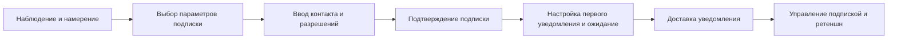

# Отчет по Практике 1: Дима Милана

**Группа:** M3305
**Участники:** Дима Милана
**Дата:** 2024-02-13

## 1. Бизнес-артефакты и планирование

### Event storming (light)

TODO: Вставьте результат от AI.

Подсказка по формату:
## Actors
- End User (Web/Mobile) — управляет подписками через REST API, получает in-app/push/email уведомления
- External Weather API (Provider) — даёт прогнозы/алерты; источник WeatherForecastUpdated
- Scheduler / Orchestrator — планировщик задач (cron, cloud scheduler) вызывает RefreshForecast и запускает периодические jobs
- Delivery Worker / Notification Service — отвечает за ProcessNotificationQueue и интеграцию с внешними каналами (FCM/APNs, SMTP, Telegram Bot API)
- Дополнительный актор: Telegram Bot (опционально) — двунаправленный: принимает Subscribe/Unsubscribe и доставляет сообщения

## Commands
- SubscribeToCity
От кого: клиент (web/mobile) или Bot
Что делает: создаёт подписку и эмитит UserSubscribedToCity
Параметры: user_id, city_id, channels, preferences
Ответ: subscription_id / error

- UnsubscribeFromCity
От кого: клиент / Bot
Что делает: помечает подписку неактивной и эмитит UserUnsubscribedFromCity
Параметры: user_id, city_id, channels(optional)

- RefreshForecast
От кого: scheduler / operator
Что делает: запрашивает прогноз у внешнего Weather API для указанного набора городов; эмитит WeatherForecastUpdated
Параметры: city_id(s) or batch, provider_id, force_flag

- SendNotification / ProcessNotificationQueue
От кого: delivery worker / orchestration
Что делает: берёт NotificationScheduled из очереди и пытается доставить по каналам; эмитит NotificationDelivered или NotificationFailed
Параметры: notification_id, attempt_number

## Domain Events
- UserSubscribedToCity
Поля: user_id, city_id, channels [telegram,push,email,in-app], preferences {thresholds,quiet_hours}, created_at, source
Источник: REST API (клиент web/mobile), Telegram Bot
Последствия: создать запись подписки в БД; опубликовать событие для воркера ScheduleNotification
Проверки: валидность user_id и city_id, права доступа, дублирующая подписка

- UserUnsubscribedFromCity
Поля: user_id, city_id, channels_removed, removed_at, source
Источник: REST API / Bot
Последствия: снять подписку в БД; отменить запланированные уведомления; логировать изменение
Проверки: наличие активной подписки, подтверждение владельца

- WeatherForecastUpdated
Поля: city_id, provider_id, fetched_at, forecast_version, forecast_summary, forecast_payload (raw JSON), ttl
Источник: интеграция с внешним Weather API (periodic pull / webhook)
Последствия: сохранить snapshot прогноза; запустить правила сравнения (diff) для генерации Alarm/Alert событий; обновить кеш
Проверки: подпись/валидность ответа провайдера, таймстемп, процент недостающих полей

- WeatherAlertTriggered
Поля: alert_id, city_id, alert_type (heavy_rain,storm,temp_drop,frost), severity, observed_at, details, trigger_reason
Источник: правило сравнения (внутренний сервис) при получении WeatherForecastUpdated или по push от провайдера
Последствия: создать NotificationScheduled для подписанных пользователей; создать Audit запись
Проверки: соответствие порогам пользователя, окно тихих часов, дублирование одного алерта

- NotificationScheduled
Поля: notification_id, user_id, city_id, channels, scheduled_at, payload_summary, status (scheduled)
Источник: генератор уведомлений (в ответ на WeatherAlertTriggered или по расписанию)
Последствия: поместить задачу в очередь доставки (broker); отслеживать статус доставки
Проверки: доступность каналов доставки для user_id, формат payload

- NotificationDelivered / NotificationFailed
Поля: notification_id, user_id, channel, delivered_at / failed_at, provider_msg_id, error_code, retry_count
Источник: delivery worker / внешний push/email/telegram provider
Последствия: обновить статус, при ошибке запустить retry или пометить permanent-failure; метрики и алерты на SLA
Проверки: id совпадает, таймстемп в пределах ожиданий


### CJM

# CJM: Подписка → Уведомления (WeatherService)

Файл содержит Customer Journey Map (CJM) из 7 шагов для сценария подписка → уведомления в WeatherService.

## Краткое описание
Сценарий охватывает путь пользователя от намерения подписаться на погодные уведомления до получения и управления этими уведомлениями.

## CJM (7 шагов)
1. Наблюдение и намерение
   - Действие пользователя: обнаруживает возможность подписки в приложении или на сайте (баннер, карточка прогноза, рекомендация).
   - Эмоции: любопытство, интерес, осторожность.
   - Pain points: неясная ценность подписки, слишком много опций, опасения по поводу спама.
   - Возможности: четкий CTA, краткое объяснение преимуществ и примеров уведомлений.

2. Выбор параметров подписки
   - Действие пользователя: выбирает тип уведомлений (утренняя сводка, предупреждения о погодных опасностях), канал (push, email, sms), частоту и локализацию.
   - Эмоции: вовлеченность, сомнение при множестве настроек.
   - Pain points: сложная форма, незнакомые термины, отсутствие предустановок.
   - Возможности: умные предустановки, подсказки, шаблоны для популярных сценариев.

3. Ввод контакта и разрешений
   - Действие пользователя: вводит email/телефон, разрешает push-уведомления в браузере/мобильном приложении.
   - Эмоции: настороженность, стремление к быстрому завершению.
   - Pain points: многоступенчатые разрешения, недоверие к вводу номера/почты, сложный UI для разрешений в браузере/OS.
   - Возможности: минимизация полей, явные гарантии приватности, объяснение зачем нужны разрешения.

4. Подтверждение подписки
   - Действие пользователя: подтверждает email/SMS (код или ссылка) или видит подтверждение в интерфейсе приложения.
   - Эмоции: удовлетворение при быстром подтверждении, раздражение при задержке.
   - Pain points: письма уходит в спам, SMS задерживается, неочевидные инструкции по подтверждению.
   - Возможности: резервные каналы подтверждения, информирование о времени доставки и инструкции по спаму.

5. Настройка первого уведомления и ожидание
   - Действие пользователя: получает информацию о первом уведомлении (когда ждать), может протестировать уведомление.
   - Эмоции: ожидание, лёгкая тревога за корректность настроек.
   - Pain points: отсутствие тестового уведомления, неясность когда придёт первое сообщение.
   - Возможности: кнопка "Отправить тестовое уведомление", индикатор состояния подписки.

6. Доставка уведомления
   - Действие пользователя: получает уведомление (push/email/sms) с погодным прогнозом или предупреждением.
   - Эмоции: радость при полезной информации, разочарование при нерелевантных/частых уведомлениях.
   - Pain points: опоздавшая или лишняя нотификация, непонятный формат, отсутствие важной информации (локация, время действия).
   - Возможности: персонализация контента, четкий CTA в уведомлении, время, зона и уровень риска.

7. Управление подпиской и ретеншн
   - Действие пользователя: переходит в настройки для изменения частоты, каналов или отписки; оценивает полезность.
   - Эмоции: контроль или усталость от изменений.
   - Pain points: трудная отписка, разбросанные настройки по приложению, отсутствие истории уведомлений.
   - Возможности: единый интерфейс управления подписками, быстрый переключатель on/off, журнал последних уведомлений.

---

## Дополнительные разделы (коротко)
- Ключевые метрики для мониторинга
  - CTR уведомлений, процент подтверждений подписки, скорость доставки, доля успешных push, процент отписок.

- Риски и ограничения
  - Ограничения SMS, операционные лимиты push, требования к соответствию GDPR/законодательству по согласиям.

## Mermaid диаграмма (включена для визуализации)


## Примечание
Этот файл предназначен как первый рабочий вариант CJM. Дальнейшие шаги: уточнить у PO приоритет каналов, согласовать текст уведомлений и подготовить требования для реализации (events, API, retry policy, TTL, SLA).


### Roadmap

## Roadmap: версии и обоснование

v1.0 — Minimum Lovable Product (MLP)
- Что включено:
  - Базовая подписка через email и push (в приложении)
  - Простая форма подписки (email + выбор типа уведомлений: ежедневная сводка / предупреждения)
  - Подтверждение email (ссылка)
  - Отправка базовых уведомлений: утренняя сводка и предупреждение о сильной погоде
  - Метрики: подтверждения подписки, доставляемость email, CTR уведомлений
- Почему:
  - Быстрая проверка спроса и ценности уведомлений при минимальном объёме разработки
  - Email и встроенные push покрывают большинство пользователей без сложных интеграций

v1.1 — Улучшение качества доставки и управление подпиской
- Что включено:
  - Добавление SMS как опционального канала для критических предупреждений (при интеграции провайдера)
  - Тестовое уведомление и индикатор статуса подписки
  - Простейшая панель управления подписками в профиле (вкл/выкл, выбор каналов)
  - Retry policy для пушей и email, мониторинг задержек
- Почему:
  - Повышение надежности и доверия пользователей (тестовое уведомление, статус)
  - SMS — важен для критических оповещений и тех, кто не пользуется приложением

v2.0 — Персонализация и расширенные сценарии
- Что включено:
  - Гибкие правила триггеров (custom thresholds по ветру/осадкам/температуре)
  - Геофенсинг и уведомления по привязанным локациям
  - Rich notifications: картинка, CTA, период действия, подробная карточка риска
  - История уведомлений и аналитика пользовательских реакций
  - SLA/SLI формализация: целевые показатели доставки и latency
- Почему:
  - Создание высокой ценности для удержания пользователей через персонализированные и релевантные нотификации
  - Подготовка платформы для коммерческих возможностей (премиум-функции, таргетированные советы)


### Epics

## Epics (4–6)
1. Epic: Subscription Core
   - Описание: Механика подписки и хранения предпочтений пользователя (канал, частота, локации).
   - Цель: Упрощённый путь подписки и корректная сохранность настроек и согласий.
   - Включает: формы подписки, подтверждения, CRUD предпочтений.

2. Epic: Delivery Pipeline
   - Описание: Надёжная система доставки уведомлений через push/email/sms с retry и DLQ.
   - Цель: Обеспечить доставку сообщений в заданные SLA и минимизировать потери.
   - Включает: queueing, retry policy, throttling, интеграции с провайдерами.

3. Epic: Notification Content & Triggers
   - Описание: Создание шаблонов уведомлений, триггеров (пороговые события), локализация.
   - Цель: Доставлять релевантные и понятные уведомления пользователю.
   - Включает: шаблоны, переменные, rules engine для триггеров.

4. Epic: UX / Subscription Management
   - Описание: Интерфейсы подтверждения, тестирования, управления подписками (в приложении и веб).
   - Цель: Возможность контролировать подписки и быстро тестировать настройки.
   - Включает: UI профиля, тестовое уведомление, журнал уведомлений.

5. Epic: Observability & Reliability
   - Описание: Метрики, алерты, дашборды и SLI/SLA для каналов доставки.
   - Цель: Обеспечить видимость состояния pipeline и реагирование на инциденты.
   - Включает: метрики доставки, latency, error rates, мониторинг витков retry.

6. Epic: Compliance & Data Protection
   - Описание: Сбор и хранение согласий, механизмы удаления данных, аудит логов.
   - Цель: Соответствие GDPR и локальным требованиям по обработке контактов.
   - Включает: логирование согласий, retention policy, opt-out flows.

## Соответствие версиям (кратко)
- v1.0: Основной функционал подписки, подтверждение, базовая доставка.
- v1.1: Увеличение надежности и UX (тестовые уведомления, SMS, метрики).
- v2.0: Персонализация и расширенные сценарии.


### User Stories

1. Story 1 — Подписка на утреннюю сводку (v1.0)
   - Как пользователь, я хочу подписаться на ежедневную утреннюю сводку по email для моей локации, чтобы получать краткий прогноз перед выходом из дома.
   - Acceptance criteria:
     - Есть кнопка подписки в UI прогноза.
     - Форма собирает email и тип уведомления (утренняя сводка).
     - На email отправляется письмо подтверждения с ссылкой.
     - После подтверждения у пользователя появляется запись в БД подписок.

2. Story 2 — Критические предупреждения по SMS (v1.1)
   - Как пользователь, я хочу получать SMS о сильных погодных угрозах для сохранённых локаций, чтобы получить быстрый сигнал даже без приложения.
   - Acceptance criteria:
     - Пользователь может добавить телефон и выбрать SMS для критических предупреждений.
     - Система отправляет SMS при срабатывании порога (например, шквал ветра > X м/с).
     - Логирование попыток доставки и статусов (sent, delivered, failed).

3. Story 3 — Тестовое уведомление и статус подписки (v1.1)
   - Как пользователь, я хочу отправить тестовое уведомление и увидеть текущий статус подписки, чтобы убедиться, что всё настроено верно.
   - Acceptance criteria:
     - В UI доступна кнопка "Отправить тестовое уведомление".
     - Тестовое уведомление приходит по выбранному каналу.
     - Статус подписки отображается в профиле (active/pending/failed).

4. Story 4 — Надёжная доставка с retry и DLQ (v1.0 / v1.1)
   - Как инженер, я хочу, чтобы неудачные попытки доставки автоматически ретраились по политике и падали в DLQ после лимита, чтобы не терять критические уведомления.
   - Acceptance criteria:
     - Конфигурируемая retry policy (exponential backoff) реализована.
     - Сообщения, у которых исчерпаны попытки, попадают в DLQ с метаданными об ошибках.
     - Есть мониторинг числа сообщений в DLQ.

5. Story 5 — Персонализированные триггеры (v2.0)
   - Как пользователь, я хочу задать пороговые правила (например температура < -10C или осадки > 20mm) для уведомлений, чтобы получать только релевантные оповещения.
   - Acceptance criteria:
     - UI позволяет создать правило с выбором метрики, оператора и порога.
     - Rules engine оценивает события и формирует уведомления по совпадению.
     - Пользователь может редактировать и удалять правила.

6. Story 6 — Дашборд метрик доставки (v1.1 / v2.0)
   - Как продукт-менеджер, я хочу видеть метрики доставки и latency по каналам, чтобы оценить качество доставки и принимать решения.
   - Acceptance criteria:
     - Дашборд показывает SLI: delivery rate, avg latency, 95th percentile.
     - Можно фильтровать по каналу (push/email/sms) и времени.

7. Story 7 — Лёгкий opt-out и лог согласий (v1.0 / v1.1)
   - Как пользователь, я хочу просто отписаться и видеть историю моих согласий, чтобы контролировать, какие контакты и когда были использованы.
   - Acceptance criteria:
     - В каждом уведомлении есть ссылка/инструкция для отписки (email и SMS).
     - Система хранит и отображает историю согласий и отписок.
     - Есть API для удаления контактных данных по запросу.


### Definition of Ready (DoR)

# DoR (Definition of Ready) — Подписки и Уведомления (WeatherService)

Ниже 6 пунктов DoR, которые нужно выполнить, прежде чем брать задачу в спринт.

1. User story и Acceptance Criteria
   - Полное описание user story и минимум 2–3 acceptance criteria в Gherkin-стиле (Given/When/Then).
   - Критерии включают проверку создания подписки, подтверждения, доставки и обработки ошибок.

2. UX/Copy и дизайн-артефакты
   - Финальные макеты экранов/модалей для подписки, подтверждения и управления подписками.
   - Текст писем/SMS и i18n-ключи готовы. Включены примеры CTA и fallback-тексты для недостающих полей.

3. API / Events контракт и payload samples
   - Описаны REST-эндпоинты и внутренние события (см. `plans/backend_requirements.md`), включены примеры request/response и webhook payloads.
   - Назначен владелец контракта (API owner).

4. Инфраструктурные зависимости и конфигурация
   - Указаны провайдеры (email/SMS/push), очередь сообщений, quota и credentials; есть доступы/секреты в vault или инструкция для их получения.
   - Наличие feature-flag для поэтапного включения канала/ретраев.

5. Observability и тестовые данные
   - Список метрик/дэшбордов (delivery_rate, p95 latency, DLQ count) и критерии тревоги.
   - Подготовлены тестовые контакты/токены и план для e2e тестов (включая симуляцию ошибок провайдера).

6. Соответствие и безопасность
   - Модель согласий (consent) определена и хранение контактов соответствует политике конфиденциальности.
   - Определён процесс обработки DSR (удаление/анонимизация) и требования по шифрованию.


## 2. Архитектура

### Компоненты

TODO: Список компонентов
1. FastAPI Backend (REST API)
2. PostgreSQL Database (подписки пользователей)
3. OpenWeatherMap API (данные о погоде)
4. Client Apps (веб/мобильные приложения)


### ADR

# ADR-001: Архитектурное решение для подписок и доставки уведомлений — WeatherService

Дата: 2026-02-13
Автор: Roo (архитектор)
Статус: Рекомендуемое решение (рfc для согласования с PO/DevOps)

## Контекст
WeatherService планирует внедрить систему подписок пользователей на погодные уведомления (push/email/sms). Требования включают: надёжную доставку, соблюдение согласий (consent), возможность управления подпиской пользователем и мониторинг качества доставки. См. смежные артефакты: [`plans/backend_requirements.md`](plans/backend_requirements.md:1) и [`plans/notification_templates.md`](plans/notification_templates.md:1).

## Принятое решение
1. Архитектура: асинхронный pipeline с очередями
   - scheduler / rules-engine => enqueue notification task => dispatcher(s) => provider adapters
   - Использовать очередь сообщений (Kafka/Rabbit/SQS) между компонентами для устойчивости и масштабирования.
2. Каналы и провайдеры: внешний провайдер для email (SendGrid/SES), SMS (Twilio или локальный провайдер), push через FCM/APNs
   - Не разрабатывать собственный SMTP/SMS-сервис, а интегрироваться с SaaS-провайдерами.
3. Хранение подписок: реляционная БД (Postgres) с таблицей subscriptions и audit-логами согласий
   - Subscription record содержит contact, channels, preferences, consent, status.
4. Политика retry и DLQ
   - Exponential backoff с jitter; настраиваемые лимиты по каналу; по исчерпанию попыток — DLQ для ручного анализа.
5. Idempotency и дедупликация
   - Idempotency-key для операций создания/триггеров.
   - Дедупликация на уровне dispatcher по composite key (subscription_id + rule_id + window).
6. Observability
   - Метрики: delivery_rate, attempts, p95 latency, DLQ count; tracing (request_id/event_id) сквозь pipeline.
7. Compliance
   - Хранение и логирование consent, механизмы удаления/анонимизации, шифрование контактов at-rest.

## Альтернативы и аргументы
A. Синхронная отправка уведомлений напрямую из правил (без очереди)
- Плюсы: проще, ниже латентность в простых сценариях.
- Минусы: низкая устойчивость; при падении провайдера блокируется rules-engine; сложнее горизонтально масштабировать.
- Последствия: повышенный риск потерь сообщений и деградации системы при нагрузке.

B. Хранение подписок в NoSQL (Cassandra/Redis) вместо Postgres
- Плюсы: высокая скорость записи, масштабируемость для огромного числа подписок.
- Минусы: сложнее реализовать транзакционность и консистентность согласий; сложнее запросы для аудита.
- Последствия: возможные трудности с реализацией DSR и отчетностью по consent.

C. Собственный SMTP/SMS-шлюз
- Плюсы: контроль, потенциальное снижение стоимости при большом объеме.
- Минусы: высокий операционный overhead, обеспечение доставляемости и соответствия anti-spam.
- Последствия: время разработки и поддержки значительно возрастёт; риск ухудшения delivery.

D. Простая retry-политика (фиксированная задержка) вместо exponential backoff
- Плюсы: проще в реализации.
- Минусы: хуже справляется с пиковыми нагрузками и кратковременными провалами провайдера.
- Последствия: либо избыточные попытки в короткие окна, либо большая задержка при восстановлении.

E. Отказ от DLQ (удалять/игнорировать недоставляемые)
- Плюсы: упрощение реализации.
- Минусы: теряется возможность анализа и исправления проблем.
- Последствия: накопление незаметных проблем с доставкой и высокий churn пользователей.

## Последствия выбранного решения
- Оверхед: необходимость поддержки очередей и операционной части (конфигурация, мониторинг, scaling).
- Латентность: добавление очереди в pipeline увеличит латентность отправки, но p95 диспатча можно держать в целевых 10s при корректной конфигурации.
- Надёжность: высока — очереди, retry, DLQ обеспечат устойчивость к временным ошибкам провайдеров.
- Экономика: интеграция с внешними провайдерами повышает оперативные расходы, но снижает риски и время разработки.
- Соответствие: выбранная модель упрощает сохранение и аудит согласий, что важно для GDPR/локальных требований.

## Требуемые следующими шагами (actice items)
- Утвердить провайдеров (email/SMS/push) и получить доступы/ключи.
- Настроить очередь сообщений и шаблон окружения (dev/staging/prod).
- Инструментировать SLI/метрики и создать первые дашборды (delivery_rate, p95 latency, DLQ count).
- Реализовать idempotency и DLQ-формат с необходимыми метаданными.


### Mermaid
```mermaid

# Architecture diagram (Mermaid) — Подписки и Уведомления (WeatherService)

Ниже диаграмма компонентов и связей, основанная на принятом архитектурном решении (async pipeline, queue, dispatcher, provider adapters).

```mermaid
flowchart LR
  subgraph Client[Клиент]
    UI[Web/Mobile App]
  end

  UI -->|REST / GraphQL| API[API Gateway]
  API --> Auth[Auth Service]
  API --> SubSvc[Subscription Service
(Postgres)]
  API --> AdminUI[Admin / UX]

  Rules[Rules Engine / Scheduler] -->|plan/trigger| EventBus((Message Queue
Kafka / Rabbit / SQS))
  SubSvc -->|enqueue| EventBus

  EventBus --> Dispatcher[Dispatcher / Worker Pool]
  Dispatcher --> AdapterEmail[Email Adapter (SendGrid/SES)]
  Dispatcher --> AdapterSMS[SMS Adapter (Twilio / Local)]
  Dispatcher --> AdapterPush[Push Adapter (FCM / APNs)]

  AdapterEmail --> ProviderEmail[Email Provider]
  AdapterSMS --> ProviderSMS[SMS Provider]
  AdapterPush --> ProviderPush[Push Provider]

  ProviderEmail -->|webhook status| Webhook[/hooks/provider/delivery]
  ProviderSMS --> Webhook
  ProviderPush --> Webhook
  Webhook --> API

  Dispatcher --> DLQ[(Dead Letter Queue)]

  Dispatcher --> Observ[Observability / Tracing / Metrics]
  EventBus --> Observ
  SubSvc --> ConsentStore[Consent & Audit Log]
  ConsentStore --> Compliance[Compliance / DSR]

  classDef infra stroke:#333,stroke-width:1px,fill:#f9f9f9;
  class EventBus,Dispatcher,DLQ infra;
```

Легенда:
- API Gateway — входная точка для UI и внутренних вызовов.
- Subscription Service — хранение подписок, согласий и управление статусами.
- Rules Engine / Scheduler — генерирует события по правилам (cron/thresholds).
- Event Bus — очередь сообщений между компонентами.
- Dispatcher — рабочие процессы, которые формируют final payload и отправляют провайдерам.
- Provider Adapters — абстракция над внешними почтовыми/SMS/push сервисами.
- DLQ — хранилище сообщений после исчерпания retry-политики.
- Observability — метрики, дашборды и трассировка (tracing headers).

```

### Ссылка на схему


## 3. Качество

### Definition of Done

# DoD (Definition of Done) — Подписки и Уведомления (WeatherService)

Список из 5 пунктов, необходимых для пометки фичи как готовой к релизу.

1. Feature implemented и покрытие тестами
   - Backend: unit tests для логики подписок/диспетчера и интеграционные тесты для retry/DLQ.
   - Frontend: e2e-скрипт для подписки/подтверждения и тестового уведомления.

2. API и контракты задокументированы
   - OpenAPI/Swagger для публичных endpoint`ов и примеры payload для внутренних событий.
   - Подписаны контрактные поля с командами-потребителями (API owner).

3. Observability и алерты настроены
   - Дашборд с ключевыми метриками (delivery_rate, p95 latency, DLQ count) в prod/staging.
   - Алерты при порогах (drop in delivery_rate, DLQ spike).

4. Compliance и безопасность
   - Consent хранится и доступен для аудита; DSR-адаптер протестирован.
   - Все секреты и провайдерские ключи хранятся в Vault, доступные роли задокументированы.

5. Документация и handoff
   - Обновлён CJM и roadmap в `plans/cjm.md`.
   - Передача команде QA и разработчикам: checklist тест-кейсов и agenda для handoff-meeting.


### План тестирования

# Testing Plan — Подписки и Уведомления (WeatherService)

Минимум 8 тест-кейсов, покрывающих позитивные и негативные сценарии, а также e2e и нагрузочные проверки.

1. TC-01: Позитивная подписка по email
   - Шаги: POST /api/v1/subscriptions с валидным email; подтверждение по ссылке; проверка записи в БД.
   - Ожидаемый результат: статус подписки pending -> active, email подтверждение отправлено.

2. TC-02: Позитивная подписка push (device token)
   - Шаги: Регистрация device token, выбор push-канала, отправка тестового уведомления.
   - Ожидаемый результат: push доставлен (или зафиксирован как dispatched), статус подписки active.

3. TC-03: Негативный: некорректный email/phone
   - Шаги: Попытка создать подписку с неверным форматом email/phone
   - Ожидаемый результат: валидация возвращает 4xx, подписка не создаётся.

4. TC-04: Подтверждение не доставлено (email попал в спам) — fallback и повторная отправка
   - Шаги: Сымитировать задержку доставки/помещение в спам; инициировать повторную отправку подтверждения.
   - Ожидаемый результат: система позволяет запросить повтор и логирует статус попыток.

5. TC-05: Retry и DLQ при ошибках провайдера
   - Шаги: Симуляция временных ошибок от провайдера (5xx) для уведомления; наблюдение за retry attempts и попаданием в DLQ после N попыток.
   - Ожидаемый результат: attempts увеличиваются, после лимита запись в DLQ с причина и raw payload.

6. TC-06: Персонализированные триггеры (v2.0)
   - Шаги: Создать правило порога (температура < -10C); отправить тестовый event, соответствующий условию.
   - Ожидаемый результат: правило срабатывает, соответствующие подписчики получают уведомление.

7. TC-07: Нагрузка: массовая рассылка утренней сводки
   - Шаги: Смоделировать 100k подписчиков, запустить scheduled job для рассылки утренней сводки.
   - Ожидаемый результат: система масштабируется через очереди, p95 dispatch latency в пределах целевого порога, отсутствие массовых ошибок.

8. TC-08: Compliance / DSR
   - Шаги: Подать запрос на удаление контактных данных пользователя; проверить, что контакт удалён/анонимизирован и audit-log содержит запись.
   - Ожидаемый результат: контакт удалён, все связанные подписки помечены как deleted/unsubscribed, audit-log создан.

Дополнительные тесты:
- TC-09: Webhook provider: обработка статусов delivered/failed
- TC-10: Idempotency: повторный POST с тем же idempotency_key не создаёт дубликат


### Functional Delivery (Jira-тикеты)

# Jira tickets (8) — WeatherService: Подписки и Уведомления

Ниже 8 тикетов, готовых для импорта в Jira. Каждый тикет содержит Title, Description, Acceptance Criteria, Test cases и Dependencies/Notes.

---

1) Title: SUB-001 — Subscription API и модель данных
Description:
  Разработать REST API для создания, подтверждения, получения и обновления подписок. Реализовать модель Subscription в Postgres с полями contact, channels, preferences, consent, status.
Acceptance Criteria:
  - POST /api/v1/subscriptions создает запись со статусом pending
  - POST /api/v1/subscriptions/confirm переводит статус в active при валидном токене
  - GET /api/v1/subscriptions/{id} возвращает корректные данные
  - PATCH /api/v1/subscriptions/{id} обновляет preferences и channels
Test cases:
  - TC: создать подписку с валидным email -> проверить pending запись
  - TC: подтвердить подписку по токену -> статус active
  - TC: обновить каналы -> проверки в БД
Dependencies/Notes:
  - Зависит от: доступ к Postgres, секреты для генерации токенов
  - Design: UX-макеты подписки (см. [`plans/cjm.md`](plans/cjm.md:1))

---

2) Title: SUB-002 — Email confirmation flow и шаблоны
Description:
  Реализовать отправку email-подтверждений при создании подписки, шаблоны письма и endpoint для повторной отправки подтверждения.
Acceptance Criteria:
  - Письмо с confirmation_link отправляется при создании подписки
  - confirmation_link ведёт на API, где POST /subscriptions/confirm принимает токен
  - В письме есть unsubscribe-link
Test cases:
  - TC: создать подписку -> проверить отправку email (mock/провайдер)
  - TC: ссылка подтверждения переводит подписку в active
  - TC: письмо содержит unsubscribe ссылку
Dependencies/Notes:
  - Интеграция с провайдером email (SendGrid/SES)
  - Требуется шаблоны i18n (см. [`plans/notification_templates.md`](plans/notification_templates.md:1))

---

3) Title: SUB-003 — Push интеграция (FCM / APNs)
Description:
  Поддержать push-уведомления: регистрацию device_token, отправку тестового уведомления и обработку статусов доставки.
Acceptance Criteria:
  - UI/endpoint для регистрации device_token реализован
  - Тестовое push-уведомление доставляется при нажатии кнопки
  - Webhook/статусы провайдера корректно обрабатываются
Test cases:
  - TC: зарегистрировать device_token -> отправить test push -> проверить dispatched
  - TC: симуляция провайдера returning delivered/failed -> проверить обновление NotificationRecord
Dependencies/Notes:
  - Нужны ключи FCM/APNs и настройка push adapter
  - Обратить внимание на platform-specific permission flows

---

4) Title: SUB-004 — SMS для критических предупреждений
Description:
  Добавить канал SMS для критических предупреждений: форма добавления номера, верификация (код/SMS) и интеграция с SMS-провайдером.
Acceptance Criteria:
  - Пользователь может добавить номер телефона и выбрать SMS для alerts
  - При срабатывании alert генерируется SMS и отправляется провайдеру
  - Логируются статусы отправки и попытки
Test cases:
  - TC: добавить номер -> получить код подтверждения -> подтвердить
  - TC: при trigger alert -> проверить запись в NotificationRecord и попытки отправки
  - TC: симуляция failed -> retry и DLQ поведение
Dependencies/Notes:
  - Интеграция с локальным или глобальным SMS провайдером (Twilio и т.п.)
  - Региональные ограничения и стоимость

---

5) Title: SUB-005 — Delivery Pipeline: Dispatcher, Retry и DLQ
Description:
  Построить pipeline: EventBus (queue) -> Dispatcher workers -> Provider adapters; реализовать retry policy (exponential backoff) и DLQ.
Acceptance Criteria:
  - Notifications от scheduler/rules попадают в очередь
  - Dispatcher пытается отправить, повторяет по конфигу и помещает в DLQ при исчерпании попыток
  - NotificationRecord хранит attempts, last_error и provider_message_id
Test cases:
  - TC: enqueue notification -> dispatcher обрабатывает -> provider получает request
  - TC: симуляция 5xx -> multiple retries -> после N попыток запись в DLQ
  - TC: idempotency: повторный enqueue с тем же idempotency-key не создает дубликата
Dependencies/Notes:
  - Требуется выбор EventBus (Kafka/Rabbit/SQS)
  - Инструментирование tracing/metrics

---

6) Title: SUB-006 — Rules Engine и триггеры (cron/threshold)
Description:
  Реализовать rules engine для scheduled и threshold-based триггеров, экспортировать событие notification.scheduled в очередь.
Acceptance Criteria:
  - Можно создать правило: cron (daily_summary) и threshold (например wind_speed > X)
  - При наступлении условия генерируется event notification.scheduled
  - Rules могут быть привязаны к локациям и подпискам
Test cases:
  - TC: создать cron-rule -> проверить generation of events в ожидаемое время
  - TC: создать threshold-rule -> отправить mock-weather-event -> проверить генерацию notification
Dependencies/Notes:
  - Возможно выделенный сервис rules-engine или использование существующего scheduler

---

7) Title: SUB-007 — Observability, метрики и алерты
Description:
  Настроить сбор метрик и дашборды: delivery_rate, attempts, p95 dispatch latency, DLQ count; настроить алерты при деградации.
Acceptance Criteria:
  - Есть дашборд с ключевыми SLI/SLAs
  - Настроены алерты: drop in delivery_rate, DLQ spike, p95 latency > threshold
  - События трассируются через pipeline (request_id/event_id)
Test cases:
  - TC: сымитировать падение delivery_rate -> проверить, что alert сработал
  - TC: проверить наличие трассы по request_id в логах для заданного notification_id
Dependencies/Notes:
  - Интеграция с Prometheus/Grafana или облачной APM

---

8) Title: SUB-008 — Compliance, Consent и DSR
Description:
  Обеспечить хранение согласий (consent), реализацию процесса DSR (удаление/анонимизация), audit-log всех изменений статуса подписки.
Acceptance Criteria:
  - Consent сохраняется при создании подписки с timestamp и source
  - Есть API для подачи DSR и удаления/анонимизации контакта
  - Audit-log сохраняет все изменения статусов и запросы на удаление
Test cases:
  - TC: создать подписку с consent -> проверить запись consent
  - TC: выполнить DSR -> проверить удаление/анонимизацию и audit-log
Dependencies/Notes:
  - Согласовать с legal/GDPR командой формат хранения и retention policy

---


## 4. Домашнее задание

### LLD по Epic

TODO: Выберите один Epic и сделайте LLD.

Допустимые форматы:
- Markdown (описание модулей/эндпоинтов/контрактов)
- схема (Mermaid/Draw.io) + пояснение


### DoR v2.0

TODO: Улучшите DoR до версии 2.0 (что добавили и почему).


### DoD v2.0

TODO: Улучшите DoD до версии 2.0 (что добавили и почему).


### Edge Cases (*)

TODO: (Опционально) 10 граничных случаев для v1.0/v1.1.


## 5. Журнал промптов

**Задача:** 1.0.1 Event Storming (ChatGPT-5-mini)
> WeatherService - REST API сервис уведомлений о погоде: - подписка на города и управление подписками; - получение текущей погоды/прогноза из внешнего Weather API; - клиенты: веб/мобильные приложения (опционально: Telegram Bot). Проведи Event stroming: 1) перечисли 5-7 events 2) перечисли 3–5 commands 3) перечисли 3–5 actors

*Результат:* Сгенерировался список из 6 events, 4 commands, 4 actors + 1 дополнительный.
---
**Задача:** 1.0.2 CJM (ChatGPT-5-mini)
> Собери CJM из 6-8 шагов для сценария "подписка → уведомления" в WeatherService. Для каждого этапа пропиши эмоции и pain ponts.

*Результат:* Сгенерировался CJM из 7 шагов, каждый шаг включает описание действий пользователя, эмоций и pain points, а также возможности для улучшения опыта.
---
**Задача:** 1.0.3 Roadmap (ChatGPT-5-mini)
> Предложи roadmap по версиям v1.0/v1.1/v2.0: что войдёт в каждую версию и почему.

*Результат:* Сгенерировался roadmap с 3 версиями
---
**Задача:** 1.0.4 Epics (ChatGPT-5-mini)
> Предложи 4–6 epics для проекта WeatherService.

*Результат:* Сгенерировался список из 6 Epics.
---
**Задача:** 1.1 User Stories (ChatGPT-5-mini)
> Предложи 5–7 user stories для проекта WeatherService.

*Результат:* Сгенерировался список из 7 user stories
---
**Задача:** 1.2 DoR (ChatGPT-5-mini)
> Для WeatherService подготовь список критериев DoR на 4-6 пунктов

*Результат:* Сгенерировался чек-лист DoR из 6 пунктов
---
**Задача:** 2.1 Архитектура - компоненты (ChatGPT-5-mini)
> Составь для WeatherService краткий ADR с описанием контекста, решений альтернатив и последствий

*Результат:* Сгенерировался ADR с описанием контекста, решений, альтернатив и последствий
---
**Задача:** 2.2 Mermaid (ChatGPT-5-mini)
> На основе принятых архитектурных решений составь Mermaid диаграмму с компонентами и связями

*Результат:* Сгенерировалась диаграмма с компонентами и их связями
---
**Задача:** 3.1 DoD (ChatGPT-5-mini)
> На основе полученных ранее артефактов составь список критериев DoD из 4-6 пунктов

*Результат:* Сгенерировался DoD из 5 пунктов
---
**Задача:** 3.2 Test Plan (ChatGPT-5-mini)
> Для WeatherService составь план тестирования минимум из 8 пунктов. Необходимо покрыть как позитивные, так и негативные  сценарии

*Результат:* Сгенерировался план тестирования
---
**Задача:** 3.3 Jira (ChatGPT-5-mini)
> Раздели работу на 6-10 Jira тикетов. Каждый тикет должен иметь Title, Description, Acceptance Criteria, Test cases, Dependencies/Notes

*Результат:* Сгенерировался список из 8 Jira тикетов
---

## 6. Рефлексия

**Инсайт:** TODO: Главный инсайт практики.

**Критика AI:** TODO: Что AI сделал плохо? Где он ошибся в планировании?

