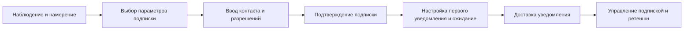

# CJM: Подписка → Уведомления (WeatherService)

Файл содержит Customer Journey Map (CJM) из 7 шагов для сценария подписка → уведомления в WeatherService и roadmap по версиям.

## Краткое описание
Сценарий охватывает путь пользователя от намерения подписаться на погодные уведомления до получения и управления этими уведомлениями.

## CJM (7 шагов)
1. Наблюдение и намерение
   - Действие пользователя: обнаруживает возможность подписки в приложении или на сайте (баннер, карточка прогноза, рекомендация).
   - Эмоции: любопытство, интерес, осторожность.
   - Pain points: неясная ценность подписки, слишком много опций, опасения по поводу спама.
   - Возможности: четкий CTA, краткое объяснение преимуществ и примеров уведомлений.

2. Выбор параметров подписки
   - Действие пользователя: выбирает тип уведомлений (утренняя сводка, предупреждения о погодных опасностях), канал (push, email, sms), частоту и локализацию.
   - Эмоции: вовлеченность, сомнение при множестве настроек.
   - Pain points: сложная форма, незнакомые термины, отсутствие предустановок.
   - Возможности: умные предустановки, подсказки, шаблоны для популярных сценариев.

3. Ввод контакта и разрешений
   - Действие пользователя: вводит email/телефон, разрешает push-уведомления в браузере/мобильном приложении.
   - Эмоции: настороженность, стремление к быстрому завершению.
   - Pain points: многоступенчатые разрешения, недоверие к вводу номера/почты, сложный UI для разрешений в браузере/OS.
   - Возможности: минимизация полей, явные гарантии приватности, объяснение зачем нужны разрешения.

4. Подтверждение подписки
   - Действие пользователя: подтверждает email/SMS (код или ссылка) или видит подтверждение в интерфейсе приложения.
   - Эмоции: удовлетворение при быстром подтверждении, раздражение при задержке.
   - Pain points: письма уходит в спам, SMS задерживается, неочевидные инструкции по подтверждению.
   - Возможности: резервные каналы подтверждения, информирование о времени доставки и инструкции по спаму.

5. Настройка первого уведомления и ожидание
   - Действие пользователя: получает информацию о первом уведомлении (когда ждать), может протестировать уведомление.
   - Эмоции: ожидание, лёгкая тревога за корректность настроек.
   - Pain points: отсутствие тестового уведомления, неясность когда придёт первое сообщение.
   - Возможности: кнопка "Отправить тестовое уведомление", индикатор состояния подписки.

6. Доставка уведомления
   - Действие пользователя: получает уведомление (push/email/sms) с погодным прогнозом или предупреждением.
   - Эмоции: радость при полезной информации, разочарование при нерелевантных/частых уведомлениях.
   - Pain points: опоздавшая или лишняя нотификация, непонятный формат, отсутствие важной информации (локация, время действия).
   - Возможности: персонализация контента, четкий CTA в уведомлении, время, зона и уровень риска.

7. Управление подпиской и ретеншн
   - Действие пользователя: переходит в настройки для изменения частоты, каналов или отписки; оценивает полезность.
   - Эмоции: контроль или усталость от изменений.
   - Pain points: трудная отписка, разбросанные настройки по приложению, отсутствие истории уведомлений.
   - Возможности: единый интерфейс управления подписками, быстрый переключатель on/off, журнал последних уведомлений.

---

## Roadmap: версии и обоснование

v1.0 — Minimum Lovable Product (MLP)
- Что включено:
  - Базовая подписка через email и push (в приложении)
  - Простая форма подписки (email + выбор типа уведомлений: ежедневная сводка / предупреждения)
  - Подтверждение email (ссылка)
  - Отправка базовых уведомлений: утренняя сводка и предупреждение о сильной погоде
  - Метрики: подтверждения подписки, доставляемость email, CTR уведомлений
- Почему:
  - Быстрая проверка спроса и ценности уведомлений при минимальном объёме разработки
  - Email и встроенные push покрывают большинство пользователей без сложных интеграций

v1.1 — Улучшение качества доставки и управление подпиской
- Что включено:
  - Добавление SMS как опционального канала для критических предупреждений (при интеграции провайдера)
  - Тестовое уведомление и индикатор статуса подписки
  - Простейшая панель управления подписками в профиле (вкл/выкл, выбор каналов)
  - Retry policy для пушей и email, мониторинг задержек
- Почему:
  - Повышение надежности и доверия пользователей (тестовое уведомление, статус)
  - SMS — важен для критических оповещений и тех, кто не пользуется приложением

v2.0 — Персонализация и расширенные сценарии
- Что включено:
  - Гибкие правила триггеров (custom thresholds по ветру/осадкам/температуре)
  - Геофенсинг и уведомления по привязанным локациям
  - Rich notifications: картинка, CTA, период действия, подробная карточка риска
  - История уведомлений и аналитика пользовательских реакций
  - SLA/SLI формализация: целевые показатели доставки и latency
- Почему:
  - Создание высокой ценности для удержания пользователей через персонализированные и релевантные нотификации
  - Подготовка платформы для коммерческих возможностей (премиум-функции, таргетированные советы)

---

## Ключевые замечания для релизов
- Убедиться, что механизмы согласия и хранения контактов соответствуют GDPR/локальному законодательству.
- Определить основные SLI/SLA для каждого канала (push/email/sms) уже на v1.1 и формализовать на v2.0.
- План тестирования: e2e тесты доставки, нагрузочное тестирование notification pipeline, QA-скрипты для подтверждений и отписок.

## Mermaid диаграмма

---

Файл обновлён как рабочий вариант roadmap и CJM. Дальнейшие шаги: согласование с PO/UX, подготовка требований для реализации и создание дизайн-артефактов.
