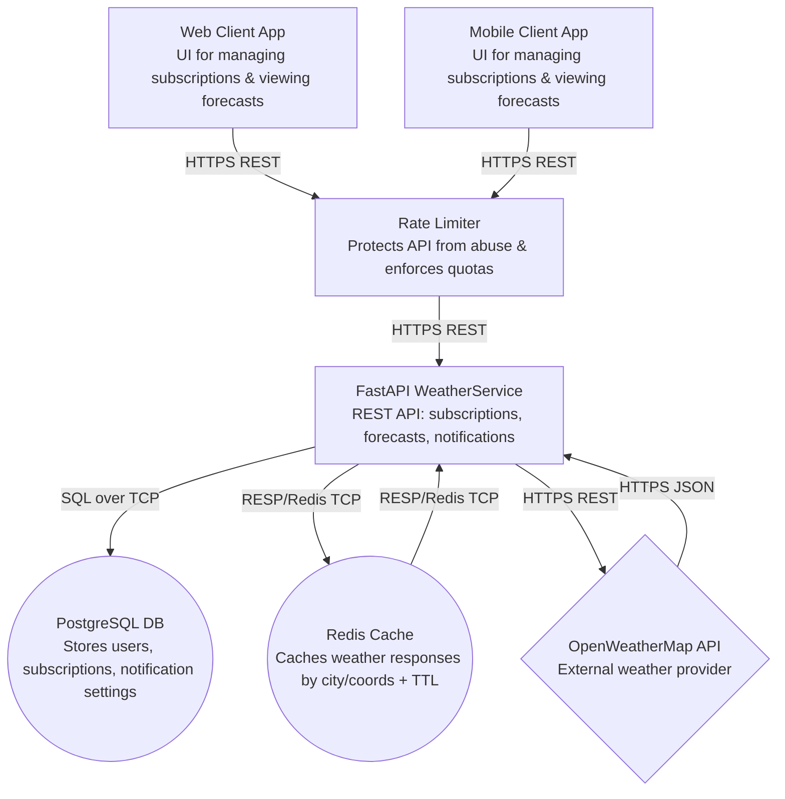

# Архитектурная схема WeatherService v2 (Mermaid)

```mermaid
graph TB
  %% Clients
  WEB[Web Client App<br/>UI for managing subscriptions & viewing forecasts]
  MOB[Mobile Client App<br/>UI for managing subscriptions & viewing forecasts]

  %% Edge / Protection
  RL[Rate Limiter<br/>Protects API from abuse & enforces quotas]

  %% Core service
  API[FastAPI WeatherService<br/>REST API: subscriptions, forecasts, notifications]

  %% Data stores
  PG((PostgreSQL DB<br/>Stores users, subscriptions, notification settings))
  REDIS((Redis Cache<br/>Caches weather responses by city/coords + TTL))

  %% External dependency
  OWM{OpenWeatherMap API<br/>External weather provider}

  %% Flows
  WEB -->|HTTPS REST| RL
  MOB -->|HTTPS REST| RL

  RL -->|HTTPS REST| API

  API -->|SQL over TCP| PG

  %% Cache-aside pattern
  API -->|RESP/Redis TCP| REDIS
  REDIS -->|RESP/Redis TCP| API

  API -->|HTTPS REST| OWM
  OWM -->|HTTPS JSON| API

  %% Notes: cache fill path is implicit: miss -> OWM -> API -> REDIS (set with TTL) -> respond
```
